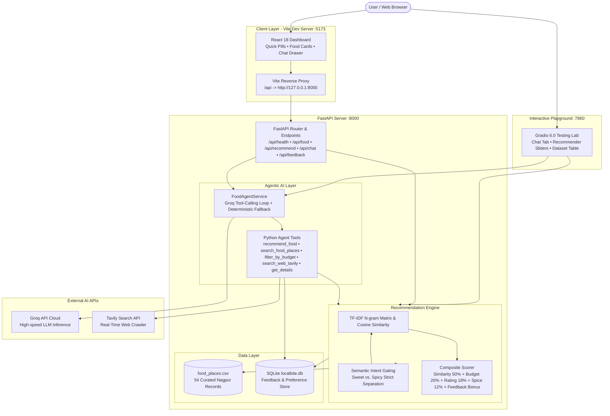

# LocalBite AI — AI-Based Local Food Recommendation Agent

[](https://www.python.org/downloads/)
[](https://fastapi.tiangolo.com)
[](https://react.dev)
[](https://vitejs.dev)
[](https://tailwindcss.com)
[](https://groq.com/)
[](https://tavily.com/)
[](https://gradio.app/)
[](https://opensource.org/licenses/MIT)

> **Author**: Tanmay Sankulwar  
> **Project**: Problem-Based Learning (PBL) / Academic Showcase  
> **Target Region**: Nagpur, Maharashtra, India  
> **GitHub Repository**: [https://github.com/Tanmay-1607/AI-Based-Local-Food-Recommendation-Agent](https://github.com/Tanmay-1607/AI-Based-Local-Food-Recommendation-Agent)

---

## 📖 1. Project Overview

**LocalBite AI** is an intelligent, full-stack local culinary recommendation and discovery platform. Designed specifically for the gastronomic culture of **Nagpur, Maharashtra, India**, LocalBite AI bridges the gap between generic review portals and authentic local food discovery. 

The system combines:
1. **Machine Learning Content Recommender**: TF-IDF vectorization and cosine similarity over rich dish descriptions, local specialties, budget ceilings, spice tiers, and ratings.
2. **Conversational AI Concierge**: Powered by Groq's high-speed LLM inference engine with automated multi-turn tool calling and live web search via Tavily Search API.
3. **Strict Semantic Safety Gating**: Mathematically separates sweet/dessert cravings from fiery savory delicacies (such as Saoji and Tarri Poha), eliminating category confusion.
4. **Adaptive Personalization Loop**: SQLite-persisted feedback (likes, dislikes, ratings) dynamically recalibrates match percentages in real-time.
5. **Modern Reactive UI**: Built with React 18, Vite, Tailwind CSS, Lucide icons, and a secondary Gradio 6.0 testing lab.

---

## ❓ 2. Problem Statement

Popular restaurant recommendation apps (e.g., Zomato, Swiggy, Google Maps) primarily rank eateries by ad sponsorships, aggregate reviews, or delivery proximity. Consequently, users frequently face key limitations:
- **Lack of Cultural & Regional Context**: Iconic local delicacies (e.g., authentic Saoji mutton rassa, Sitabuldi tarri poha, or orange santra barfi) get overshadowed by commercial chains.
- **Inability to Parse Natural Craving Intent**: Searching for *"spicy vegetarian breakfast under ₹150 in Dharampeth"* often returns irrelevant fast food chains or completely ignores budget and spice constraints.
- **Category Confusion (Sweet vs. Spicy)**: Standard search engines frequently suggest spicy dishes under "sweet" queries simply because a restaurant name contains the word "Sweets" (e.g., savory snacks at sweet shops).
- **Black-Box Scoring**: Users cannot see *why* an eatery was chosen or how their budget, dietary preference, and past feedback influenced the choice.

---

## 🎯 3. Project Objectives

- **Develop a Domain-Specific Recommendation Engine**: Curate authentic Nagpur food options spanning 8+ localities (Dharampeth, Sadar, Sitabuldi, Mahal, Ramdaspeth, Itwari, Bajaj Nagar, Pratap Nagar, VNIT Mate Square).
- **Implement Transparent Multi-Criteria Scoring**: Combine cosine similarity (content match), budget ratio fit, rating thresholds, spice compatibility, and previous feedback into a normalized percentage score.
- **Engineer an Agentic AI Food Concierge**: Enable natural language interaction via Groq tool calling, allowing the agent to query local databases, inspect restaurant details, filter budgets, and perform live web searches via Tavily.
- **Enforce Strict Category Gating**: Ensure that dessert cravings strictly recommend sweet delicacies (Spice 1/5) while spicy cravings strictly recommend Saoji or fiery street food (Spice 3-5/5).
- **Provide Dual Interactive Interfaces**: Deliver a consumer-ready React 18 single-page dashboard and an interactive Gradio 6.0 testing playground for ML experimentation.

---

## ✨ 4. Key Features

- 🍊 **Authentic Nagpur Gastronomy Dataset**: 54 authentic food records across breakfast, street food, Maharashtrian specialties, Saoji, sweets & desserts, and Mughlai biryanis.
- 💬 **Conversational AI Agent (Groq & Tools)**: Multi-turn agent using `openai/gpt-oss-20b` on Groq, capable of executing autonomous tool calls.
- 🌐 **Real-Time Tavily Web Search**: Live internet search for recent food blogs, opening hours, reviews, and newly opened Nagpur eateries.
- 🛡️ **Zero-Spice Sweet Gating**: Bulletproof guardrails guaranteeing that dessert queries never return Tarri Poha, Saoji curries, or savory snacks.
- ⚡ **Instant Quick-Action Filter Pills**: One-click filters for *All Nagpur*, *🍊 Sweets & Desserts*, *🔥 Spicy Saoji*, *🥞 Tarri Poha*, *🌱 Pure Veg*, *💰 Under ₹100*, *💰 Under ₹200*, *☕ Breakfast*, and *🍛 Biryani*.
- 🔍 **Transparent "Why Recommended" Explanations**: Every recommendation clearly explains why it was selected (budget fit, rating, spice suitability, or past feedback match).
- 👍 **Personalized Feedback Bias**: Liking or disliking items dynamically adjusts SQLite feedback weights, boosting favored places on subsequent searches.
- 🧪 **Interactive Testing Lab (Gradio)**: Standalone Python playground for testing custom prompts, hyperparameter sliders, and dataset browsing on port `7860`.

---

## 🛠️ 5. Technologies and Tools Used

| Layer | Technology | Purpose |
|---|---|---|
| **Frontend UI** | React 18, Vite 5+, Tailwind CSS, Lucide React | High-performance, responsive single-page application |
| **Backend API** | Python 3.10+, FastAPI, Uvicorn, Pydantic v2 | Asynchronous RESTful API backend |
| **AI LLM Inference** | Groq Cloud API (`openai/gpt-oss-20b`) | Ultra-fast tool-calling conversational agent |
| **Live Web Search** | Tavily Search API (`api.tavily.com`) | Real-time web retrieval for current Nagpur food info |
| **Machine Learning** | Scikit-learn, NumPy, Pandas | TF-IDF vectorizer, N-grams (1, 2), Cosine similarity |
| **Database** | SQLite3 | Persistent storage for user likes, dislikes, and preferences |
| **Testing Playground** | Gradio 6.0 | Interactive Python web UI for prompt and ML testing |
| **Testing Suite** | Pytest, FastAPI TestClient, AnyIO | 25 automated unit and integration tests |

---

## 🏗️ 6. System Architecture



---

## 📁 7. Project Folder Structure

```
AI-Based Local Food Recommendation Agent/
├── .env.example                # Root environment template (placeholders only)
├── .gitignore                  # Git ignore rules (excludes .env, node_modules, db, caches)
├── README.md                   # Complete project documentation
├── backend/
│   ├── .env.example            # Backend environment template
│   ├── .env                    # Local private secrets (ignored by Git)
│   ├── pytest.ini              # Pytest configuration
│   ├── requirements.txt        # Python backend dependencies
│   ├── gradio_app.py           # Secondary Gradio interactive testing lab
│   ├── app/
│   │   ├── __init__.py
│   │   ├── config.py           # Settings, API key validations & environment loading
│   │   ├── database.py         # SQLite connection, schema initialization & CRUD
│   │   ├── schemas.py          # Pydantic request/response validation models
│   │   ├── recommender.py      # TF-IDF, Cosine Similarity & Sweet/Spicy guardrails
│   │   ├── tools.py            # LangChain tool functions (including Tavily web search)
│   │   ├── agent.py            # Groq tool-calling agent with safety sanitization
│   │   └── main.py             # FastAPI REST endpoints & CORS middleware
│   ├── data/
│   │   └── food_places.csv     # 54 authentic Nagpur culinary records
│   └── tests/
│       ├── test_agent.py       # Unit tests for tools, intent parser & chat
│       ├── test_api.py         # Integration tests for FastAPI endpoints
│       ├── test_recommender.py # ML tests, ranking, sweet-vs-spicy separation
│       └── verify_flow.py      # End-to-end verification script
└── frontend/
    ├── index.html              # HTML entry point
    ├── package.json            # Frontend scripts and dependencies
    ├── package-lock.json       # Lockfile
    ├── vite.config.js          # Vite config with /api reverse proxy to backend
    ├── tailwind.config.js      # Tailwind color palettes & font configurations
    ├── postcss.config.js       # PostCSS plugins
    ├── public/                 # Static assets (favicons, SVGs)
    └── src/
        ├── App.jsx             # Main dashboard, quick-filter pills & state
        ├── index.css           # Global typography & Tailwind styles
        ├── main.jsx            # React root mount
        ├── components/
        │   ├── Navbar.jsx            # Header with status pills & favorites toggle
        │   ├── FoodCard.jsx          # Interactive dish card with match score & feedback
        │   ├── FoodDetailsModal.jsx  # Detailed popup with ingredients and rationale
        │   ├── ChatDrawer.jsx        # Conversational AI assistant side drawer
        │   ├── SearchHero.jsx        # Hero search bar and prompt suggestions
        │   └── StatBanner.jsx        # Live statistics counter
        └── services/
            └── api.js                # Frontend API client communicating via /api
```

---

## ⚙️ 8. Installation and Setup Instructions

### Prerequisites
- **Python**: Version 3.10 or higher (Tested on Python 3.14.6)
- **Node.js**: Version 18.x or higher (Tested on Node v24.11.0)
- **npm**: Version 9.x or higher

### Step 1: Clone the Repository
```bash
git clone https://github.com/Tanmay-1607/AI-Based-Local-Food-Recommendation-Agent.git
cd AI-Based-Local-Food-Recommendation-Agent
```

### Step 2: Set Up Backend Environment
Create and activate a virtual environment (recommended):
```bash
# Windows (PowerShell)
python -m venv venv
.\venv\Scripts\Activate.ps1

# Linux / macOS
python3 -m venv venv
source venv/bin/activate
```

Install backend dependencies:
```bash
pip install -r backend/requirements.txt
```

### Step 3: Set Up Frontend Environment
```bash
cd frontend
npm install
cd ..
```

---

## 🔐 9. Environment Variable Setup

LocalBite AI is fully functional both **with** cloud API keys and **offline** (falling back to local deterministic intelligence).

1. Copy the example environment file:
   ```bash
   cp backend/.env.example backend/.env
   ```
2. Open `backend/.env` and insert your credentials:
   ```env
   # Groq API Credentials (Sign up at https://console.groq.com)
   GROQ_API_KEY=your_groq_api_key_here
   GROQ_MODEL=openai/gpt-oss-20b

   # Tavily Live Web Search API (Sign up at https://tavily.com)
   TAVILY_API_KEY=your_tavily_api_key_here

   # Backend Server Configuration
   PORT=8000
   HOST=127.0.0.1
   ```

> [!NOTE]
> - If `GROQ_API_KEY` is omitted, the application automatically operates in its deterministic content similarity mode with 100% uptime.
> - If `TAVILY_API_KEY` is omitted, the agent seamlessly answers using the curated local Nagpur dataset.
> - Never commit `.env` containing live secrets. The `.gitignore` file is pre-configured to protect all sensitive keys.

---

## 🚀 10. How to Run the Application

### Running the FastAPI Backend Server
From the project root:
```bash
cd backend
python -m uvicorn app.main:app --host 127.0.0.1 --port 8000 --reload
```
- **Backend Health Check**: [http://127.0.0.1:8000/api/health](http://127.0.0.1:8000/api/health)
- **Interactive Swagger Docs**: [http://127.0.0.1:8000/docs](http://127.0.0.1:8000/docs)

### Running the React Frontend Dashboard
In a separate terminal:
```bash
cd frontend
npm run dev -- --host 127.0.0.1 --port 5173
```
- **React Application**: [http://127.0.0.1:5173/](http://127.0.0.1:5173/)

### Running the Gradio Playground (Secondary Demo)
In a third terminal:
```bash
cd backend
python gradio_app.py
```
- **Gradio Testing Lab**: [http://127.0.0.1:7860/](http://127.0.0.1:7860/)

---

## 🤖 11. How to Run the AI Recommendation Agent

The AI agent can be accessed through three distinct methods:

1. **Via the React UI**:
   - Click the **"🤖 Ask LocalBite AI"** button in the top right navbar of the React dashboard.
   - Type natural language queries such as:
     - *"I want sweet dessert options in Nagpur under ₹100"*
     - *"Suggest fiery Saoji chicken in Mahal"*
     - *"Find Maharashtrian breakfast near Sitabuldi"*
   - The agent calls internal tools, filters the dataset, searches Tavily if needed, and returns grounded answers.

2. **Via REST API**:
   ```bash
   curl -X POST http://127.0.0.1:8000/api/chat \
     -H "Content-Type: application/json" \
     -d '{"message": "What are the best sweets in Sitabuldi?"}'
   ```

3. **Via Gradio Playground**:
   - Open [http://127.0.0.1:7860/](http://127.0.0.1:7860/) and switch to the **"🤖 AI Chat Agent"** tab to interact directly with tool logs visible.

---

## 📡 12. API Endpoints Reference

| Method | Endpoint | Description | Sample Payload |
|---|---|---|---|
| `GET` | `/api/health` | Service health, dataset record count, active AI engine | None |
| `GET` | `/api/meta` | Unique localities, cuisines, and food types | None |
| `GET` | `/api/food` | Filter food places by locality, cuisine, diet, or budget | Query params (`locality`, `cuisine`, `max_price`) |
| `GET` | `/api/food/{id}` | Detailed info for a single restaurant (e.g., `ngp_014`) | Path param `restaurant_id` |
| `POST` | `/api/recommend` | TF-IDF content similarity ranking with composite score | `{"query": "sweet", "top_n": 8}` |
| `POST` | `/api/chat` | Conversational agent interaction with tool calling | `{"message": "Suggest dessert under 100"}` |
| `POST` | `/api/feedback` | Store user like, dislike, or star rating in SQLite | `{"restaurant_id": "ngp_014", "feedback_type": "like"}` |
| `GET` | `/api/feedback` | Retrieve list of recorded user feedback | None |
| `GET` | `/api/preferences` | Retrieve saved user dietary & locality preferences | None |
| `POST` | `/api/preferences` | Update user dietary & locality preferences | `{"preferred_diet": "veg", "max_budget": 200}` |

---

## 📊 13. Dataset Details

The dataset ([`backend/data/food_places.csv`](file:///c:/Users/sanku/OneDrive/Desktop/AI-Based%20Local%20Food%20Recommendation%20Agent/backend/data/food_places.csv)) consists of **54 curated, authentic culinary records** from Nagpur, Maharashtra.

### Schema Fields
- `restaurant_id`: Unique identifier (e.g., `ngp_001` through `ngp_054`).
- `restaurant_name`: Name of the eatery.
- `locality`: Locality (Dharampeth, Sadar, Sitabuldi, Mahal, Ramdaspeth, Itwari, Bajaj Nagar, Pratap Nagar, Gandhibagh, VNIT Mate Square, Wardha Road).
- `cuisine`: Category (Street Food, Sweets & Desserts, Saoji, Maharashtrian, South Indian, North Indian, Mughlai, Fast Food, Continental).
- `dish_name`: Authentic signature specialty.
- `price`: Average price in INR (₹).
- `food_type`: Dietary category (`veg`, `non-veg`, `egg`).
- `spice_level`: Spice tier from 1 (sweet/mild) to 5 (extra fiery).
- `rating`: Customer rating (out of 5.0).
- `description`: Rich textual description highlighting flavor profiles, preparation techniques, and ingredients.
- `source`: Dataset attribution.
- `last_updated`: Date of dataset audit.

---

## 🧪 14. Testing Instructions & Automated Test Suite

A comprehensive test suite of **25 automated tests** validates all layers of the platform:
- **`test_recommender.py`**: Dataset loading, budget filtering, dietary restrictions, score ranking, empty query fallbacks, feedback boosting, and **sweet vs. spicy intent separation**.
- **`test_api.py`**: All FastAPI endpoints, status codes, response schemas, and 404 handlers.
- **`test_agent.py`**: All 5 LangChain tools, query intent parsing, and agent response structure.

### Running the Test Suite
```bash
cd backend
python -m pytest tests -v
```

### Test Results Summary
```
============================= test session starts =============================
platform win32 -- Python 3.14.6, pytest-9.1.1, pluggy-1.6.0
collected 25 items

tests/test_agent.py::test_tool_search_food_places PASSED                 [  4%]
tests/test_agent.py::test_tool_filter_by_budget PASSED                   [  8%]
tests/test_agent.py::test_tool_recommend_food PASSED                     [ 12%]
tests/test_agent.py::test_tool_get_food_details PASSED                   [ 16%]
tests/test_agent.py::test_tool_save_user_feedback PASSED                 [ 20%]
tests/test_agent.py::test_tool_search_web_tavily PASSED                  [ 24%]
tests/test_agent.py::test_agent_query_parsing PASSED                     [ 28%]
tests/test_agent.py::test_agent_chat_response PASSED                     [ 32%]
tests/test_api.py::test_health_endpoint PASSED                           [ 36%]
tests/test_api.py::test_metadata_endpoint PASSED                         [ 40%]
tests/test_api.py::test_get_food_places PASSED                           [ 44%]
tests/test_api.py::test_get_food_detail PASSED                           [ 48%]
tests/test_api.py::test_get_food_detail_not_found PASSED                 [ 52%]
tests/test_api.py::test_recommend_endpoint PASSED                        [ 56%]
tests/test_api.py::test_chat_endpoint PASSED                             [ 60%]
tests/test_api.py::test_feedback_and_preferences PASSED                  [ 64%]
tests/test_recommender.py::test_dataset_loaded PASSED                    [ 68%]
tests/test_recommender.py::test_budget_filtering PASSED                  [ 72%]
tests/test_recommender.py::test_cuisine_filtering PASSED                 [ 76%]
tests/test_recommender.py::test_dietary_filtering_veg PASSED             [ 80%]
tests/test_recommender.py::test_dietary_filtering_non_veg PASSED         [ 84%]
tests/test_recommender.py::test_recommendation_ranking_and_scores PASSED [ 88%]
tests/test_recommender.py::test_empty_query_fallback PASSED              [ 92%]
tests/test_recommender.py::test_feedback_personalization_boost PASSED    [ 96%]
tests/test_recommender.py::test_sweet_vs_spicy_intent_separation PASSED  [100%]

============================== 25 passed in 1.48s ==============================
```

---

## 🚢 15. Deployment Instructions (Vercel Frontend & Render Backend)

### Part 1: Deploying Backend to Render
1. Sign in to [Render](https://render.com) and click **"New +" -> "Web Service"**.
2. Connect your GitHub repository: `Tanmay-1607/AI-Based-Local-Food-Recommendation-Agent`.
3. Configure the service settings:
   - **Name**: `localbite-ai-backend` (or your preferred name)
   - **Root Directory**: `backend`
   - **Runtime**: `Python 3`
   - **Build Command**: `pip install -r requirements.txt`
   - **Start Command**: `uvicorn app.main:app --host 0.0.0.0 --port $PORT`
4. In **Environment Variables**, add:
   - `GROQ_API_KEY`: *(Your secret Groq API key)*
   - `GROQ_MODEL`: `openai/gpt-oss-20b`
   - `TAVILY_API_KEY`: *(Your secret Tavily API key)*
5. Click **Create Web Service**.
6. Once deployed, copy your public Render URL:
   - Example: `https://localbite-ai-backend.onrender.com`
   - Test it by opening: `https://localbite-ai-backend.onrender.com/api/health` in your browser (it should return `{"status":"healthy",...}`).

> [!NOTE]
> Render's free tier spins down instances after 15 minutes of inactivity. When accessed after inactivity, the first request may take ~30–50 seconds to spin up.

---

### Part 2: Deploying Frontend to Vercel & Connecting Backend

When deployed to Vercel, the frontend runs under HTTPS (`https://your-app.vercel.app`). It **cannot** connect to `http://127.0.0.1:8000` because browsers block unencrypted mixed content and localhost only exists on your local machine. You **must** provide your live Render backend URL in Vercel.

#### Step-by-Step Vercel Configuration:
1. Open your project on the [Vercel Dashboard](https://vercel.com/dashboard).
2. Go to **Settings** → **Environment Variables**.
3. Add the following variable:
   - **Key**: `VITE_API_URL`
   - **Value**: `https://your-backend-name.onrender.com` *(Replace with your actual Render URL from Part 1)*
   - **Target Environments**: Check all (Production, Preview, Development).
4. Click **Save**.

> [!TIP]
> The frontend normalizes the URL automatically. You can enter either `https://your-backend-name.onrender.com` or `https://your-backend-name.onrender.com/api` — it will never create duplicate `/api/api` paths.

#### Redeploying on Vercel to Apply Changes:
Because Vite injects `import.meta.env.VITE_*` variables at **build time**, you **must trigger a fresh build** after setting the variable:
1. In Vercel, go to the **Deployments** tab.
2. Click the three dots (`...`) on the latest deployment and choose **Redeploy**.
3. *(Important)* Make sure the option **"Use existing Build Cache"** is **UNCHECKED**.
4. Click **Redeploy**.
5. Once deployment completes, visit your Vercel site. The frontend will now connect directly to your live Render backend.

---

## 🔮 16. Future Scope

- **Real-Time Delivery & GPS Integration**: Integrate Google Places API and OpenStreetMap for live walking directions and turn-by-turn navigation across Nagpur localities.
- **Multilingual Support**: Expand the AI concierge to support natural conversations in **Marathi (मराठी)** and **Hindi (हिंदी)** alongside English.
- **Collaborative Filtering**: Implement user profile clustering once traffic scales, comparing user tasting histories to identify similar foodies.
- **Image Recognition**: Enable users to upload photos of local dishes to identify them and locate the nearest authentic vendors.

---

## 👤 Author

- **Name**: Tanmay Sankulwar
- **GitHub**: [@Tanmay-1607](https://github.com/Tanmay-1607)
- **Project**: LocalBite AI — AI-Based Local Food Recommendation Agent
- **Repository**: [https://github.com/Tanmay-1607/AI-Based-Local-Food-Recommendation-Agent](https://github.com/Tanmay-1607/AI-Based-Local-Food-Recommendation-Agent)
